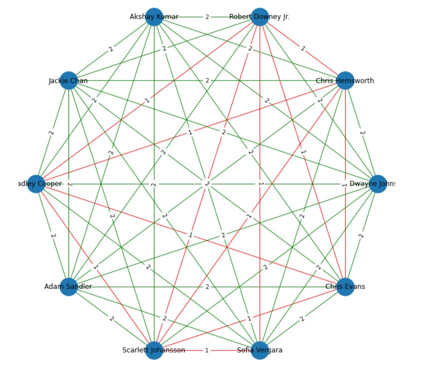

# Pet projects

## IMDB
Aim of this project is to test the skills in async programming and algorithms (in particular, the project demonstrates the usage of BFS).
IMDB project idea is to take Top 10 highly paid actors of 2019(Forbes) and to create a movie distance graph for them. 
The logic is the following: we start with some actors pair. Get top N last movies for one actor, get top M actors from those movies and check 
if the second actor from the pair is in the obtained actors list. We also save movies checked and compare them. 
Moreover, we do our BFS-based search from both sides and check movies in batches. 

Movie distance graph example:
    

## NYT telegram bot
One can provide information about interesting topics, quantity of articles and time period to the bot and  
New York Times articles' summaries based on these preferences will be returned.

Bot example:
 
   

## UCI
Aim of this project is to create full classical ML pipeline for UCI highly imbalanced dataset.
In this project, we work with the dataset based on the census data extracted from the 1994 and 1995 current population surveys conducted 
by the U.S. Census Bureau. Our goal is to predict level of income of a person: "- 50000" (means less than  50𝑘/𝑦𝑒𝑎𝑟) 𝑜𝑟 "50000+" (𝑚𝑒𝑎𝑛𝑠 𝑚𝑜𝑟𝑒 𝑡ℎ𝑎𝑛 50k/year).

The description of the data is available [here.](https://archive.ics.uci.edu/ml/datasets/Census-Income+%28KDD%29)  

## ML-based plant type classification based on time series agricultural data

Comparison of Classical ML models with Deep Learning Models.
Please see [the presentation](https://github.com/lizvladi-ds/pet_projects/blob/master/ts_classification/Gavrilova_2.pdf) for more detailed project description and results.

 
 

Please contact via telegram @lizvladi22
