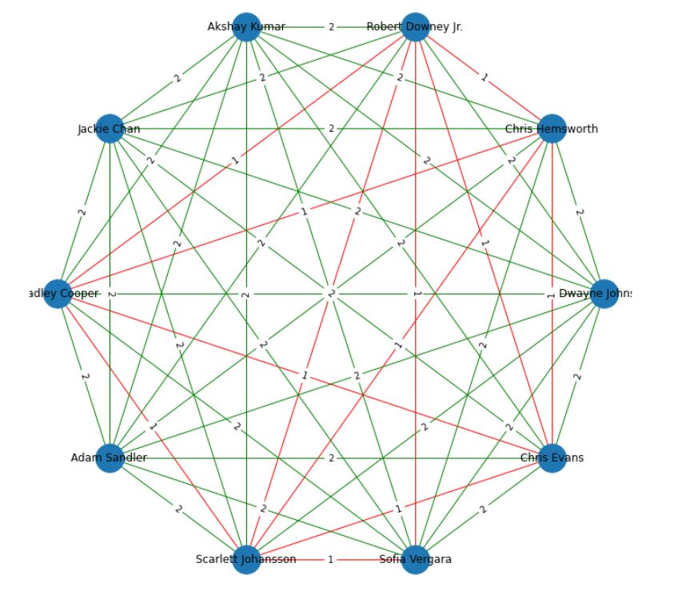
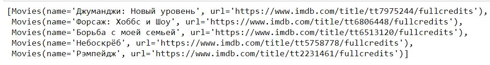
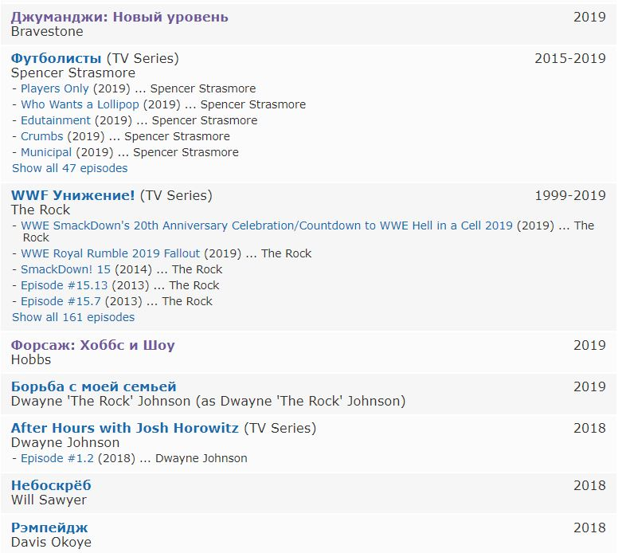
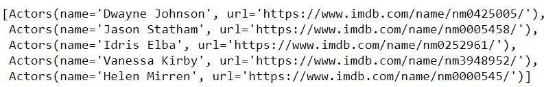
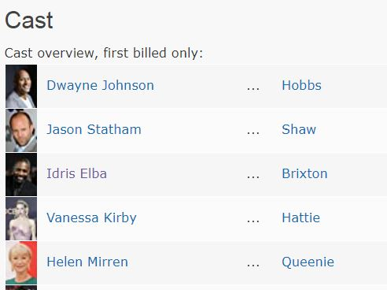

# IMDB project description

Aim of this project is to test the skills in async programming and algorithms (in particular, the project demonstrates the usage of BFS).
IMDB project idea is to take Top 10 highly paid actors of 2019(Forbes) and to create a movie distance graph for them. 

Actors are:
1. Dwayne Johnson
2. Chris Hemsworth
3. Robert Downey Jr.
4. Akshay Kumar
5. Jackie Chan
6. Bradley Cooper
7. Adam Sandler
8. Scarlett Johansson
9. Sofia Vergara
10. Chris Evans.

The basic rules are:
 - take into account only movies, no TV shows, Series, etc.
 - take into account only moveis where an actor played, not produced, voiced, directed, etc.
 - if actors played in the same movie, movie distance is 1.
 


The result can be seen on the picture below. For example, movie distance between Jackie Chan and Dwayne Johnson is 2. Interesting is that all the
top 10 highly paid actors have movie distance not more than 2.
<br>  <br>

## Algorithm

Assume we have already did several iterations of the algorithm and have a list of actors urls from some movies. We devided this list on batches with a batch size
of 20. For a batch of actors, we:
 - Get all actors soups.
 - Get all movies for all extracted actors soups.
 - Check if the other actor from pair starred in on this movies. If yes, break.
 - Else, extract movies for actors brom the batch.
 - Get all actors for all extracted movies soups.
 - Check if the other actor from pair is in the obtained actors list. If yes, break, else save actors for future processing.
 - Repeat for newly obtained actors.

The algorith is breadth-first search beased, we traverse children in our actor graph level-wise. For this purpose we use a Queue. 
Time Complexity of BFS = O(V+E) where V is vertices and E is edges in the actors graph.

## Usage example

- `import imdb_helper_functions as imdbh`<br>
  `imdbh.get_page_data_helper(url)` returns a soup of it parsed with lxml parser.
  - __url__ takes any web page url

 - `get_movies_by_actor_soup(actor_page_soup, num_of_movies_limit)`
    returns a list of the observed actor's movies. 
    - __actor_page_soup__ some actor's page processed by `imdbh.get_page_data_helper`
    - __num_of_movies_limit__ list with how many movies and their links to return
    
    <br><br>
    Let's look through an example for [Dwayne Johnson](https://www.imdb.com/name/nm0425005/):
    <br>
    ```
    soup = imdbh.get_page_data_helper(url = "https://www.imdb.com/name/nm0425005/")
    movies = await imdb.get_movies_by_actor_soup(actor_page_soup = soup, num_of_movies_limit = 5)
    ```
    
    Below we can see the returned values by the code above:
     <br>

    Let's also check IMDB if we got the right list of movies.
    
    <br>
    
    Everything is fine, only released movies, no TV series or Video shorts.
    <br><br><br>

- `get_actors_by_movie_soup(cast_page_soup, num_of_actors_limit)`
   returns a list of the observed movie's actors. 
    - __cast_page_soup__ some movie's cast page processed by `imdbh.get_page_data_helper`
    - __num_of_actors_limit__ list with how many actors and their links to return


    <br><br>
    Let's look through an example for [Fast & Furious Presents: Hobbs & Shaw](https://www.imdb.com/title/tt6806448/):
    ```
    soup = imdbh.get_page_data_helper(url = "https://www.imdb.com/title/tt6806448/")
    movies = await imdb.get_actors_by_movie_soup(cast_page_soup = soup, num_of_actors_limit = 5)
    ```
    
    Below we can see the returned values by the code above:
    <br>

    Let's also check IMDB if we got right cast list.
    
    <br>
    
    Everything is fine.
    <br><br><br>

- `get_movie_distance(actor_start_url, actor_end_url, num_of_actors_limit, num_of_movies_limit)`
If we have a couple of actors IMDB urls, we can calculate movie distance for them. 
    - __actor_start_url__ first actor in pair
    - __actor_end_url__ second actor in pair
    - __num_of_actors_limit__ how many actors to check for each movie
    - __num_of_movies_limit__ how many movies to check for each actor

    <br><br>
    Let's look through an example for [Robert Downey Jr.](https://www.imdb.com/title/nm0000375/) and [Dwayne Johnson](https://www.imdb.com/title/nm0425005/).
    We set both actors and movies limits to 5:
    ```
    await imdb.get_movie_distance(actor_start_url="https://www.imdb.com/name/nm0000375/",
                              actor_end_url="https://imdb.com/name/nm0425005/",
                              num_of_actors_limit=5,
                              num_of_movies_limit=5)
    ```
    
    Below we can see the returned values by the code above:
    <br>

    So how this distance is calculated? Dwayne Johnson acted in 'Fast & Furious Presents: Hobbs & Shaw', where also acted Idris Elba. Idris Elba acted
    in 'Avengers: Infinity War', where also acted Robert Downey Jr. So the movie distance is 2 (we counted 2 movies in this sequence).
