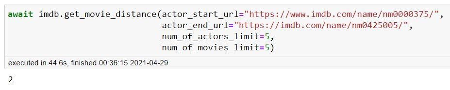

# IMDB project description

Aim of this project is to test the skills in async programming and algorithms (in particular, the project demonstrates the usage of BFS).
IMDB project idea is to take Top 10 highly paid actors of 2019(Forbes) and to create a movie distance graph for them. 
The logic is the following: we start with some actors pair. Get top N last movies for one actor, get top M actors from those movies and check 
if the second actor from the pair is in the obtained actors list. We also save movies checked and compare them. 
Moreover, we do our BFS-based search from both sides and check movies in batches. 

## Usage example

 - `get_movies_by_actor_soup`
    If we have a soup object of actor IMDB page, we can recieve a list of the observed actor's movies. <br><br>
    Let's look through an example for [Dwayne Johnson](https://www.imdb.com/name/nm0425005/):
    ```
    soup = imdbh.get_page_data_helper(url = "https://www.imdb.com/name/nm0425005/")
    movies = await imdb.get_movies_by_actor_soup(actor_page_soup = soup, num_of_movies_limit = 5)
    ```
     <br>

    Let's also check IMDB if we got the right list of movies.
    
    <br>
    
    Everything is fine, only released movies, no TV series or Video shorts.
    <br><br><br>

- `get_actors_by_movie_soup`
    If we have a soup object of a movie IMDB page, we can recieve a list of actors that played in the observed movie. <br><br>
    Let's look through an example for [Fast & Furious Presents: Hobbs & Shaw](https://www.imdb.com/title/tt6806448/):
    ```
    soup = imdbh.get_page_data_helper(url = "https://www.imdb.com/title/tt6806448/")
    movies = await imdb.get_actors_by_movie_soup(cast_page_soup = soup, num_of_actors_limit = 5)
    ```
    <br>

    Let's also check IMDB if we got right cast list.
    
    <br>
    
    Everything is fine.
    <br><br><br>

- `get_movie_distance`
    If we have a couple of actors IMDB urls, we can calculate movie distance for them. <br><br>
    Let's look through an example for [Robert Downey Jr.](https://www.imdb.com/title/nm0000375/) and [Dwayne Johnson](https://www.imdb.com/title/nm0425005/).
    We set both actors and movies limits to 5:
    ```
    await imdb.get_movie_distance(actor_start_url="https://www.imdb.com/name/nm0000375/",
                              actor_end_url="https://imdb.com/name/nm0425005/",
                              num_of_actors_limit=5,
                              num_of_movies_limit=5)
    ```
    <br>

    So how this distance is calculated? Dwayne Johnson acted in 'Fast & Furious Presents: Hobbs & Shaw', where also acted Idris Elba. Idris Elba acted
    in 'Avengers: Infinity War', where also acted Robert Downey Jr. So the movie distance is 2 (we counted 2 movies in this sequence).
