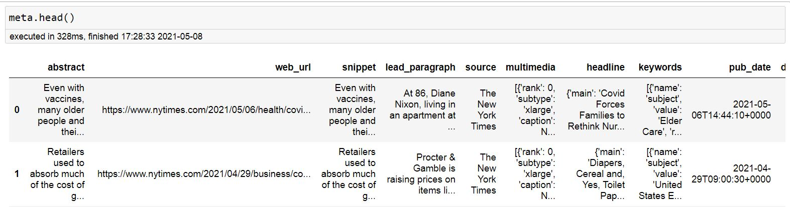
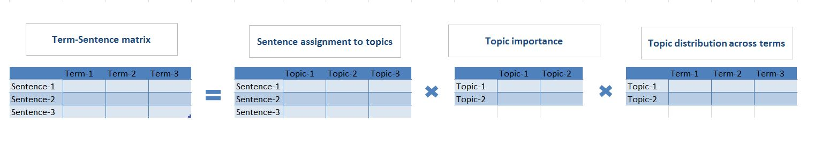
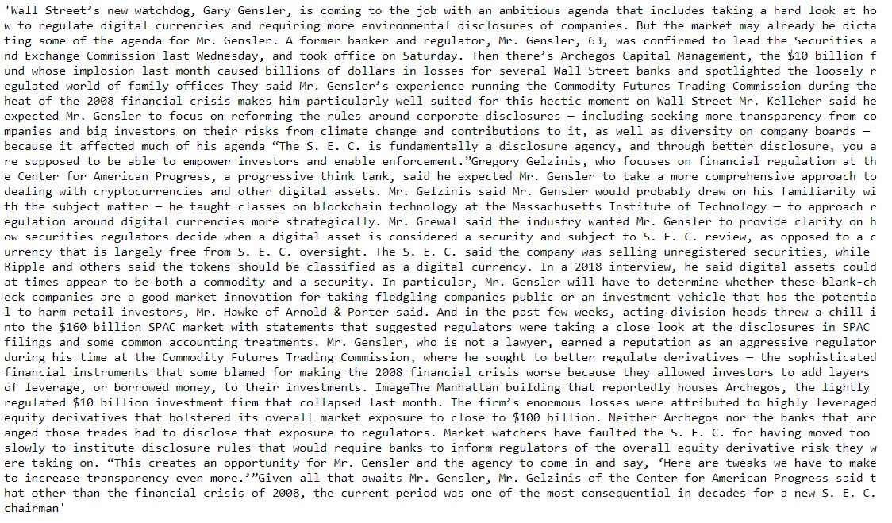
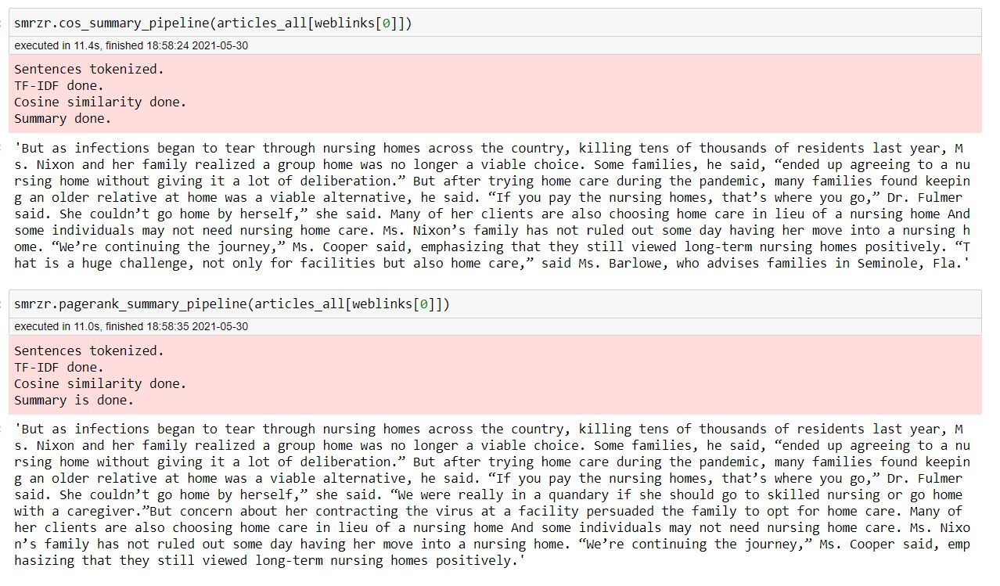

# Articles summarizer

## Bot usage instructions  
Steps that were done to create this container:
- initialize conda.yml
- initialize Dockerfile
- initialize docker-compose.yml
- build image by `docker-compose build`
- authorize by `docker login`
- push image to the docker hub by `docker-compose push`

To start the bot one needs to apply the following commands in a comman line:
- `docker pull lizvladi/telegram-bot`
- `docker run lizvladi/telegram-bot`
- go to telegram and find `@NYTSumBot`
- send `/start` message

## Bot description  
One can provide information about interesting topics, quantity of articles and time period to the bot and  
New York Times articles' summaries based on these preferences will be returned.

Bot logic is the following:
 - receive from a user information about interesting topics, time period and quantity of articles;
 - do API call to recieve NYT metadata based on the information from user;
 - knowing from the metadata which htmls to parse, parse them to get articles' texts;
 - do summaries of the articles and return them to the user.

Bot example:
 
   

## Download NYT meta data `downloader.py` 

- -n Meta data about how many articles to download. 
- -d Destination directory where to save a csv with results. csv will have name like nyt_meta_YYYYMMDD.csv 
- -t Topics of interest.   
In order to get meta data about NYT news articles with the help of its API, one needs to run a command like the following:
`python downloader.py -n 1000 -d D:git/hse/ml_project1/`. As a result 1000 articles metadata will be saved in the ml_project1
as a csv file.

Example of a result looks like:
    
 
 Meta data consists of
 - web_url link to the article
 - abstract and -snippet are usually the same. Can be empty.
 - lead_paragraph the 1st paragraph, usually 1-2 sentences
 - source which subsidiary of the NYT issued the article
 - multimedia information about pictures
 - headline all headlines an article have
 - keywords is a list with dicts. Dict consists of a key word name, value, rank and major. Can be empty.
 - pub_date Date of publication.
 - document_type We only have articles.
 - news_desk News field. Can be Science, Business, Politics, etc.
 - section_name More detailed field. Can be Health, Business Day, U.S., etc.
 - byline Information about the author of the article.
 - type_of_material We only have News.
 - _id NYT inner id.
 - word_count
 - uri
 - print_section Can be empty.
 - print_page Can be empty.
 - subsection_name Subsection of section. Can be Media, Economy, Politics, etc. Can be empty.
 
##  Parse NYT meta data to download articles texts `nyt_parser.py` 

- -m Meta data file path. 
- -d Destination file path where to save a json with results. If not exists, will be created.  
In order to download and parse NYT news articles based on the already collected meta data, one needs to run a command like the following:
`python nyt_parser.py -m D:git/hse/ml_project1/nyt_meta_20210506.csv -d D:git/hse/ml_project1/nyt_articles.json`.
As a result a nyt_articles.json file with articles will be created. Keys are articles links, value are atciles texts.
Articles links are taken from the meta data file.

##  Create article summary `summarizer.py` 
   
Assume we already have an article. To get it's summary we need to apply `svd_summary_pipeline` to it.
- text Article text.
- top_n Lower bound of absolute relation of a sentence to topics for SVD decomposition.
During this pipeline the following steps are applied:
- Custom tokenization with summarizer.tokenize_sentences()
- Tf-idf of the tokenized text.
- SVD decomposition of the tf-idf matrix prepared.
- For choosing sentences for summary we use matrix of sentences' eigenvectors multiplied by singular values matrix. 
From such a matrix we leave only the first 2 topics. Then we leave only sentences with absolute values of the components 
higher than some threshold, base one is 0.3. 
- When sentences are chosen, summary is returned.

For example, for an article about [Gary Gensler, the new S.E.C. chairman](https://www.nytimes.com/2021/04/21/business/economy/gensler-wall-street-sec.html), 
which consists of 47 sentences, we have the following summary, consisting of 16 sentences.
   

Also 2 more pipelines are avaliable, both of them recieve only an article's text: 
 - mean cosine similarity based `cos_summary_pipeline`
 - pagerank cosine similarity based `pagerank_summary_pipeline`

The logic of these 2 pipelines is quite similar: clean text, prepare tf-idf, prepare cosine similarity matrix and then choose top n sentences based
on average cosine similarity or based on cosine similarity pagerank. Number of sentences for the summary is the square root of the original
article's length.

Examples of summarizing [the following article](https://www.nytimes.com/2021/05/06/health/covid-nursing-homes.html) are represented below:
   

